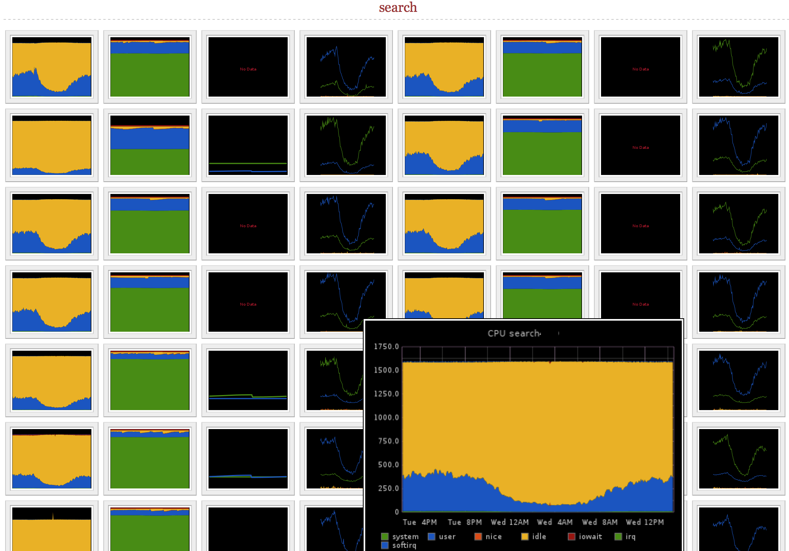

hoverbox
========

client side graphite frontend inspired by the hoverbox image galery library (http://sonspring.com/journal/hoverbox-image-gallery).
The idea was to display all hosts in graphite and have the possibility to get a zoomed version as well.

requirements:
- you need a graphite server installed and the API must be available from the client browser
- CPU, memory, disk, interrupt and swap data are in the format exposed via munin-graphite bridge (can be converted to collectd with some effort)

example:

http://10.9.240.158/hoverbox/index.html?server_list=./server-ki.json&from=-1week

install:

clone and edit index.html to set local json file. No server installation needed, just open local file in your browser.
json file can be generated with curl, e.g.:

	curl -o server-lq.json "http://graphite.lq.ecg.so/metrics/find/?query=servers.*.*.ams01.main.*&format=treejson"
	curl -k -o server-mo.json "https://graphite.corp.mobile.de/metrics/find/?query=mobile.servers.*.*&format=treejson"
	curl -k -o server-ek.json "https://graphite.corp.mobile.de/metrics/find/?query=ebayk.servers.*.*&format=treejson"

In case of server installation on the graphite host, you can also fetch json directly from graphite.

screenshot:

TODO:
- make graphite host configureable: currently defined within index.html
- for huge number of hosts the graphite api gets flooded: an index site + hostclass site would be usefull

